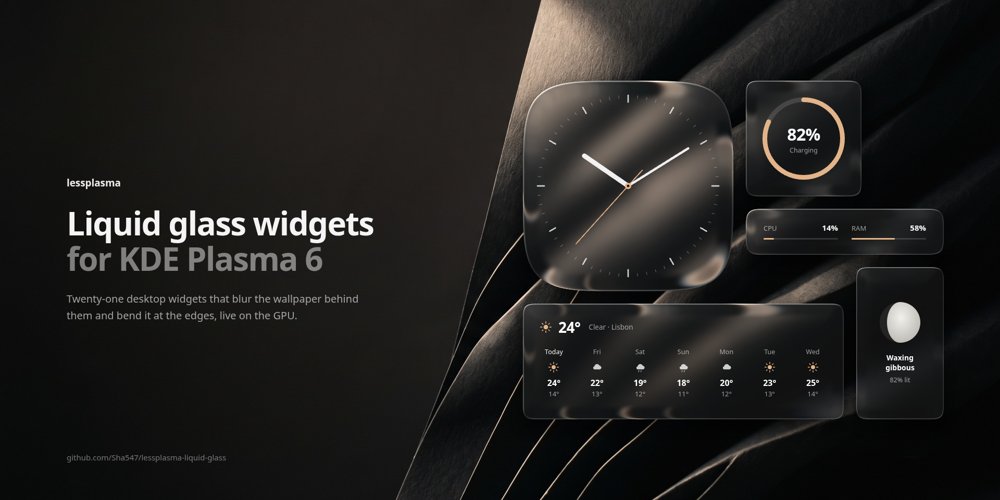
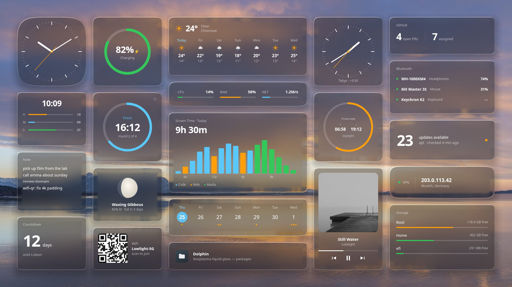
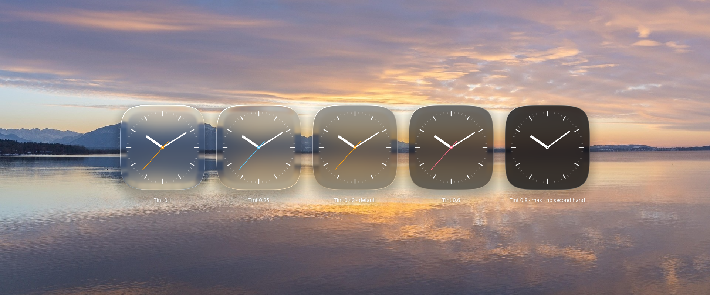
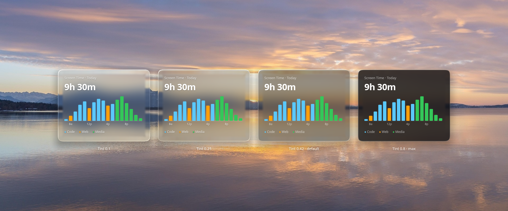
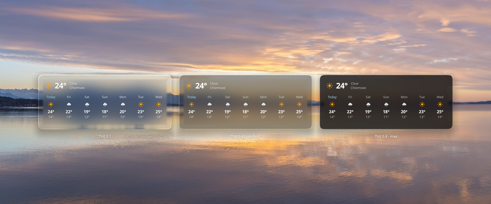
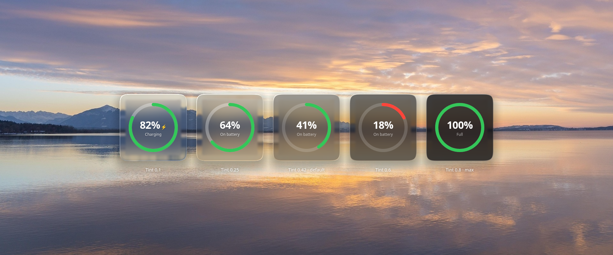
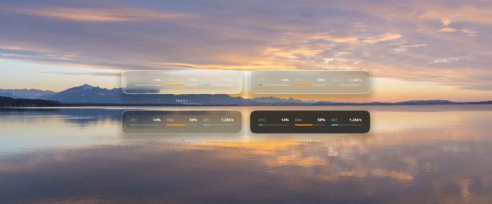
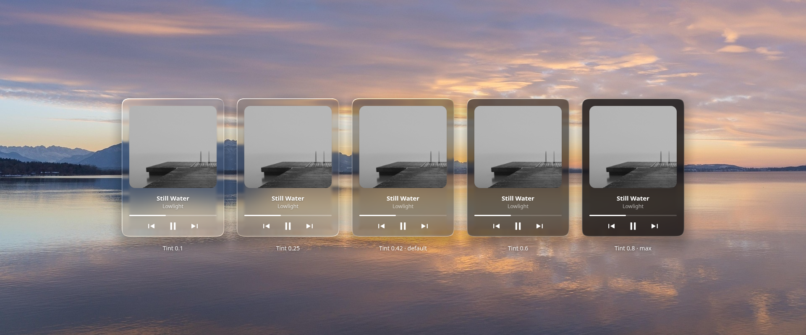

<p align="center">
    
    
</p>

Twenty-one widgets I built for my own desktop. Every card is a pane of liquid glass: it blurs the wallpaper behind it and bends it at the edge, live, on the GPU. No theme to install. If you like one, take it; the rest are independent.



---

```
$ cat lessplasma.manifest

# twenty-one widgets, all glass, all responsive

screen-time        →  per-app usage by the hour
sticky-note        →  editable note, autosaves
system-pulse       →  CPU / RAM / Net live bars
disk-usage         →  used/free per drive
calendar-strip     →  7-day strip or full month grid
wifi-qr            →  scannable QR for current network
public-ip          →  external IP, country, VPN status
bar-clock          →  time as three filling bars
now-playing        →  track, cover art, transport controls
weather-strip      →  7-day forecast, no API key
analog-clock       →  classic face, optional sweep second hand     (new)
world-clock        →  a second city's time and offset              (new)
battery-ring       →  charge as a ring, bolt when charging         (new)
pomodoro-focus     →  focus / break countdown ring                 (new)
moon-phase         →  phase, illumination, days to full moon       (new)
sun-times          →  sunrise, sunset, day progress                (new)
countdown          →  days, then hours, until a date you set       (new)
github-pulse       →  open PRs and assigned issues, via gh          (new)
bluetooth-devices  →  connected devices and their battery          (new)
active-window      →  name and title of the focused window         (new)
updates-available  →  pending package updates                      (new)

# each widget is its own folder under packages/
# install:  ./install.sh
# reload:   kquitapp6 plasmashell && kstart plasmashell
```

---

## The glass

Every widget has **Glass blur** and **Glass tint** in right-click → **Configure**. Tint runs from clear to 0.8; 0.42 is the default. Here's each widget across that range.








### How it works

KWin's blur effect can't help here. A desktop widget lives inside the same plasmashell window that paints your wallpaper, so there's nothing behind it to composite. Instead each card samples the live wallpaper item directly, crops the part under the card, and runs it through a small shader pipeline:

- a Dual Kawase blur, one to five levels deep depending on the blur setting
- a squircle-shaped mask, so corners curve the way glass does
- refraction at the edge using Snell's law through a dome-shaped bevel, with a touch of chromatic split
- a thin specular lip that follows your cursor when you hover

The blur only re-runs for a moment after something changes (the card moves, resizes, or the wallpaper changes), so a still desktop costs next to nothing. In panels and in `plasmoidviewer` there's no wallpaper behind the card, so it falls back to a plain tint.

---

## The widgets

### Screen Time `packages/screen-time`

This is the only widget here that's more than a single QML file. There's a Python daemon running as a systemd user service, plus a small KWin script that fires on every window-focus change and tells the daemon what window you switched to. The daemon keeps a running tally of seconds per app per hour in SQLite, ignores time when you're idle (it asks `org.freedesktop.ScreenSaver` how long it's been), and the widget polls it every 15 seconds.

If a category in the chart says "Other" and you don't recognize what's in it, edit `~/.local/share/plasma-screentime/categories.json` and the widget will pick the change up automatically.

### Sticky Note `packages/sticky-note`

A `TextArea` that saves to plasmoid config 600ms after you stop typing. The only widget with its own tint colour.

### System Pulse `packages/system-pulse`

Reads `/proc/stat`, `/proc/meminfo`, `/proc/net/dev` every two seconds. CPU and network are deltas between two reads, RAM is `MemTotal - MemAvailable`. Bars go green, then orange, then red as load climbs.

### Disk Usage `packages/disk-usage`

One row per mounted drive, colored by fullness. The hard part was getting `df` to ignore the dozens of fake filesystems Linux mounts (tmpfs, snap, fuse, overlays) and only show real disks.

### Calendar Strip `packages/calendar-strip`

Seven days with a dot for each upcoming event. Drag the corner to make it taller and it switches to a full month grid, with today highlighted as a blue circle. Events come from `DTSTART` lines in your local `.ics` files (Akonadi resources, KOrganizer, anything in `~/.local/share/calendars`). Online-only calendars won't show up; that's a different data source.

### WiFi QR `packages/wifi-qr`

SSID is auto-detected. Set your password once in right-click → **Configure**; it lives in plasmoid config locally. No QR is generated until the payload is actually connectable, so you never get a code that silently fails to join. `qrencode` renders the standard `WIFI:T:WPA;S:<ssid>;P:<pass>;;` payload to a PNG and any phone camera reads it.

### Public IP `packages/public-ip`

Pulls IP, city, country from `ipinfo.io` once a minute. The VPN dot is just `ip link show` grepped for `tun*`, `wg*`, `tap*`, `nordlynx`. It's not foolproof. A VPN running through an `eth*` interface won't trigger it, but it covers most setups.

### Bar Clock `packages/bar-clock`

Hours, minutes, seconds as three filling bars. The seconds bar is the only one you'll catch moving.

### Now Playing `packages/now-playing`

Whatever's playing right now: title, artist, progress, and prev/play/next. It talks to any MPRIS player (Spotify, VLC, mpv, browsers, Elisa) over D-Bus via `qdbus6`, so there's nothing extra to install. If several players are open it prefers whichever is actually playing, falling back to the first one it finds.

### Weather Strip `packages/weather-strip`

Seven days across, each with an icon and a high/low. Drag it taller and the current conditions get their own header above the strip.

Data comes from [Open-Meteo](https://open-meteo.com). It's free, with no API key and no signup, so it works the moment you add it. Location is detected from your IP via the same `ipinfo.io` lookup Public IP uses; if you'd rather not rely on that, put explicit coordinates in **Configure**. Celsius by default, Fahrenheit is a checkbox.

The forecast fetch lives in `contents/code/weather.py`, so you can run it directly to see exactly what the widget sees:

```bash
python3 packages/weather-strip/contents/code/weather.py          # auto-locate
python3 packages/weather-strip/contents/code/weather.py 48.85 2.35 c 7
```

### Analog Clock `packages/analog-clock`

A classic face with a dashed minute bezel that follows the card's shape. Pick the accent colour, hide the second hand, or let it sweep smoothly instead of ticking.

### World Clock `packages/world-clock`

A second city's time behind the same dashed bezel, with its offset from your own. Set the city name and UTC offset in **Configure**.

### Battery Ring `packages/battery-ring`

Charge as a ring, with a bolt while charging. The ring goes orange, then red, at thresholds you set. If there's no battery (a desktop), it says so instead of showing zero.

### Pomodoro Focus `packages/pomodoro-focus`

A focus/break countdown ring. Tap to start or pause, tap the corner glyph to reset. Focus and break lengths are in **Configure**.

### Moon Phase `packages/moon-phase`

Current phase, how much of the moon is lit, and days to the next full moon. Pure math, no network.

### Sun Times `packages/sun-times`

Sunrise, sunset, and how far through the day you are, as a ring. The sun maths runs locally, no API key. Put your coordinates in **Configure**, or leave them blank and it locates you with the same `ipinfo.io` lookup Weather Strip uses.

### Countdown `packages/countdown`

Days until a date you set. When it gets close it switches to hours, then minutes.

### GitHub Pulse `packages/github-pulse`

Your open pull requests and assigned issues. It uses the `gh` CLI, so it's whatever account `gh auth login` is signed into; no token to paste anywhere. Click to refresh.

### Bluetooth Devices `packages/bluetooth-devices`

Connected devices and their battery level, where the device reports one. Reads from `bluetoothctl`.

### Active Window `packages/active-window`

Name and title of the window you're focused on. Needs `xdotool` on X11 or `kdotool` on Wayland.

### Updates Available `packages/updates-available`

How many package updates are waiting. It detects apt, dnf, pacman (via `checkupdates`) or zypper on its own. Click to refresh.

---

## Install

You'll need:

| Distro | Command |
|---|---|
| Debian / Ubuntu / Neon | `sudo apt install qt6-tools python3-dbus python3-gi curl` |
| Arch | `sudo pacman -S qt6-tools python-dbus python-gobject curl` |
| Fedora | `sudo dnf install qt6-qttools python3-dbus python3-gobject curl` |

A few widgets need one extra tool, only if you use them:

| Widget | Needs |
|---|---|
| WiFi QR | `qrencode` |
| GitHub Pulse | `gh`, signed in with `gh auth login` |
| Bluetooth Devices | `bluetoothctl` (part of `bluez`, usually already installed) |
| Active Window | `xdotool` (X11) or `kdotool` (Wayland) |

```bash
git clone https://github.com/Sha547/lessplasma-liquid-glass.git
cd lessplasma-liquid-glass
./install.sh                  # all widgets
./install.sh sticky-note      # just one
```

The installer checks deps upfront, registers each plasmoid via `kpackagetool6`, sets up the Screen Time daemon, and reloads `plasmashell` for you. Once that's done, right-click desktop → **Add Widgets** → search the widget name.

If you'd rather install via "Install Widget From Local File" in the picker, build `.plasmoid` files with `./package.sh --all`, which outputs to `packaged/`.

## Develop

Quick preview of one widget without touching your live desktop:

```bash
./test.reload.sh sticky-note
```

This launches `plasmoidviewer` (or `plasmoidviewer6`, depending on your distro) against the source folder, so edits to the QML show up on the next `./test.reload.sh` run. There's no wallpaper in `plasmoidviewer`, so the glass shows as a plain tint there; check the real look on the desktop.

## Configure

Every widget has a right-click → **Configure** page for refresh intervals, colors, thresholds, and glass blur/tint.

- **Screen Time**: categories live at `~/.local/share/plasma-screentime/categories.json`. Edit to add your apps (substring match).
- **WiFi QR**: right-click → Configure to set your password.
- **World Clock**: city name and UTC offset.
- **Countdown**: the target date and a label.
- **Pomodoro Focus**: focus and break lengths.
- **Sticky Note**: just type.

## Uninstall

```bash
./uninstall.sh
```

Plasmoids and daemon go. Your usage data at `~/.local/share/plasma-screentime/` stays unless you delete it.

## License

[GPL-3.0-or-later](LICENSE).
